# Relay GPIO Connector Test Analysis

## 一、GPIO连接器

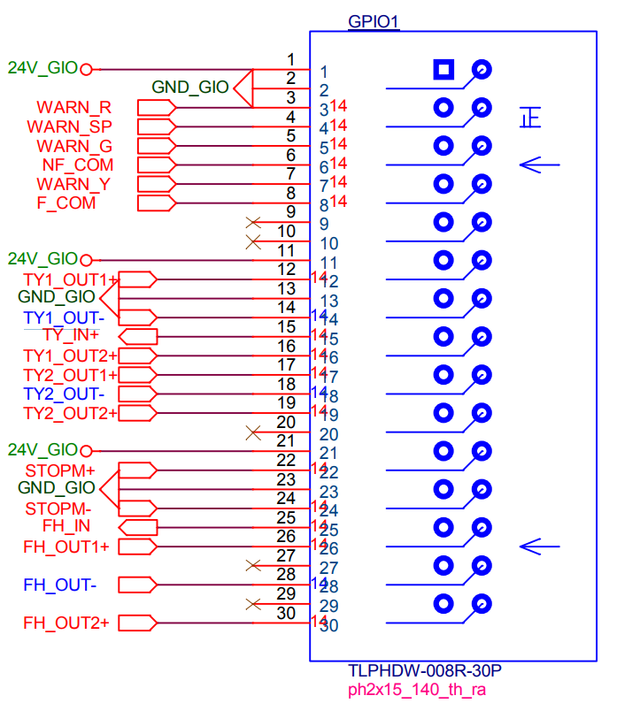

### 1.1 报警器

* `WARN_R`: 报警器红灯；
* `WARN_SP`: 报警器声音；
* `WARN_G`: 报警器绿灯；
* `WARN_Y`: 报警器黄灯。
* `F_COM`
* `NF_COM`

### 1.2 条烟OUT

#### 1.2.1 OUT1

这里通过拨码开关，区分是`TY1_OUT1+`或者`TY1_OUT2+`与`TY1_OUT-`短接。

* `TY1_OUT1+`: 条烟1输出1；
* `TY1_OUT2+`: 条烟1输出2。

#### 1.2.1 OUT1

这里通过拨码开关，区分是`TY2_OUT1+`或者`TY2_OUT2+`与`TY2_OUT-`短接。

* `TY2_OUT1+`: 条烟2输出1；
* `TY2_OUT2+`: 条烟2输出2。

### 1.3 分户OUT

这里通过拨码开关，区分是`FH_OUT1+`或者`FH_OUT2+`与`FH_OUT-`短接。

* `FH_OUT1+`: 分户输出1；
* `FH_OUT2+`: 分户输出2。

### 1.4 STOP输出

STOP输出要根据拨码开关区分是短接还是一个接地、一个接24V；

### 1.5 条烟IN、分户IN

* `TY_IN+`: 条烟输入；
* `FH_IN`: 分户输入。

## 二、报警器

### 2.1 红灯、报警

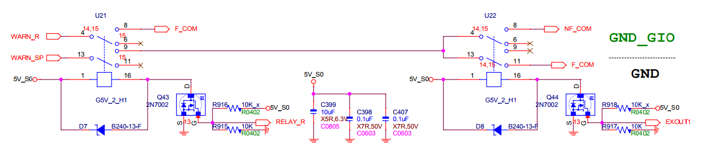

**分析说明**

* `RELAY_R`信号控制`U21`继电器的状态；
* 当继电器起作用的时候`WARN_R`连接`F_COM`；
* 当继电器起作用的时候`WARN_SP`连接`F_COM`或者`NF_COM`；

### 2.2 黄灯

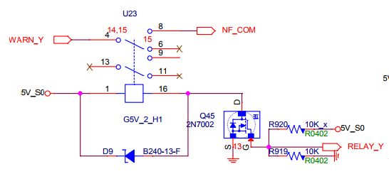

**分析说明**

* `RELAY_Y`信号控制`U23`继电器的状态；
* 当继电器起作用的时候`WARN_Y`连接`F_COM`；

### 2.3 绿灯

> 参考上一小节《2.2 黄灯》分析内容。

## 三、条烟OUT

### 3.1 CON13连接器

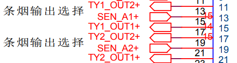

### 3.2 ECB13 Switch连接器

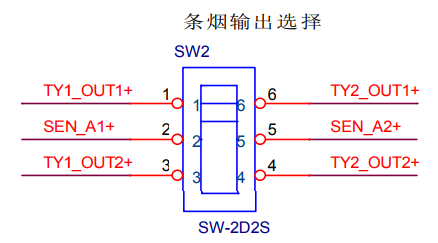

### 3.3 SEN_A1控制

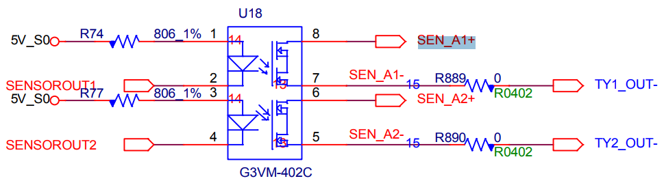

**说明**：`SENSOROUT1`、`SENSOROUT2`是`CPU`的引脚输出。

### 3.4 分析说明

* 由上可知，`SENSOROUT1`、`SENSOROUT2`光耦隔离到`SEN_A1`、`SEN_A2`；
* `SEN_A1`、`SEN_A2`经过Switch连接到`TY1_OUT`、`TY2_OUT`的1还是2上；
* 从而决定了哪个端口和`TY1_OUT-`、`TY2_OUT-`短接；

## 四、分户OUT

> 参考上一小节《三、条烟OUT》分析内容

## 五、STOP输出

### 5.1 STOPM继电器

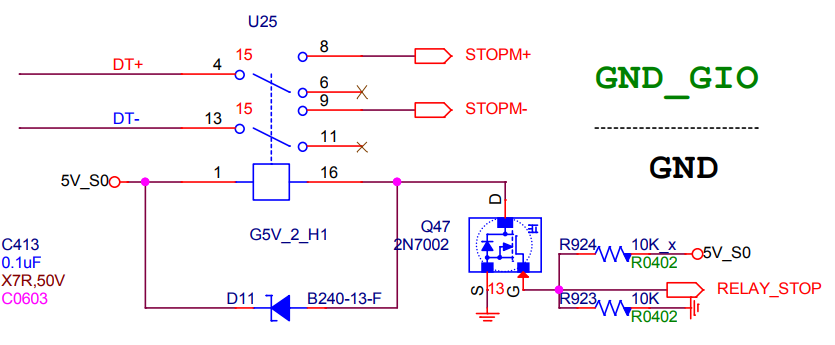

### 5.2 CON13连接器

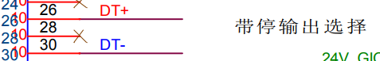

### 5.3 ECB13 Switch连接器

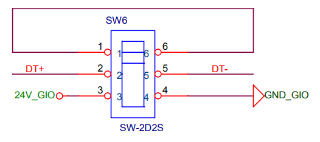

### 5.4 分析说明

这里主要是注意`DT+`、`DT-`要么是短接，要么就是`DT+`为24V、`DT-`接地。

## 六、条烟IN、分户IN

### 6.1 CON13连接器

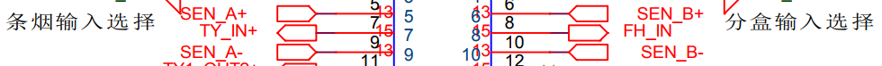

### 6.2 ECB13 Switch连接器

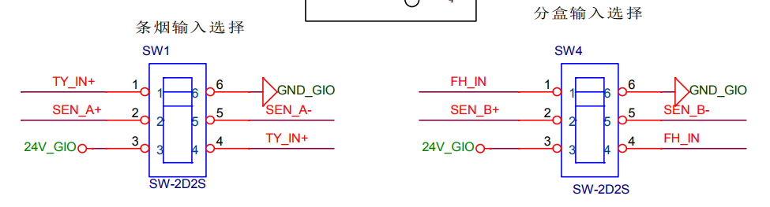

### 6.3 条烟输入光耦隔离输入检测

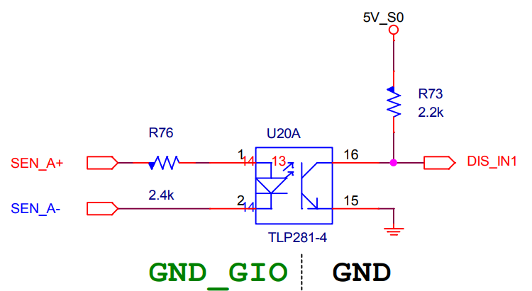

**说明**

DIS_IN1是CPU输入引脚。

### 6.3 分析说明

如上原理图可知，条烟IN、分户IN都是可以直接输入的24V的，将输出的24V电压连接到该引脚上，这样就可以完成检测了。

## 七、测试可行性分析

### 7.1 条烟IN、分户IN测试结论

将`TY_IN+`、`FH_IN`连接到一起，后面文档中表述的`TY_IN+`，代表的就是`TY_IN+`和`FH_IN`；

### 7.2 报警灯接口测试结论

* `F_COM`、`NF_COM`接24V；
* `WARN_G`、`WARN_R`、`WARN_SP`、`WARN_Y`均接到`TY_IN+`；

### 7.3 条烟OUT测试结论

* 条烟OUT的拨码开关拨到`TY1_OUT1+`、`TY2_OUT1+`；
* `TY1_OUT1+`、`TY2_OUT1+`接24V；
* `TY1_OUT-`、`TY2_OUT-`连接到`TY_IN+`；

### 7.4 分户OUT测试结论

* 条烟OUT的拨码开关拨到`FH_OUT1+`；
* `FH_OUT1+`接24V；
* `FH_OUT-`连接到`TY_IN+`；

### 7.5 STOP测试结论

* `STOP`的拨码开关拨到短接线上；
* `STOPM+`接24V；
* `STOPM-`接`TY_IN+`；
